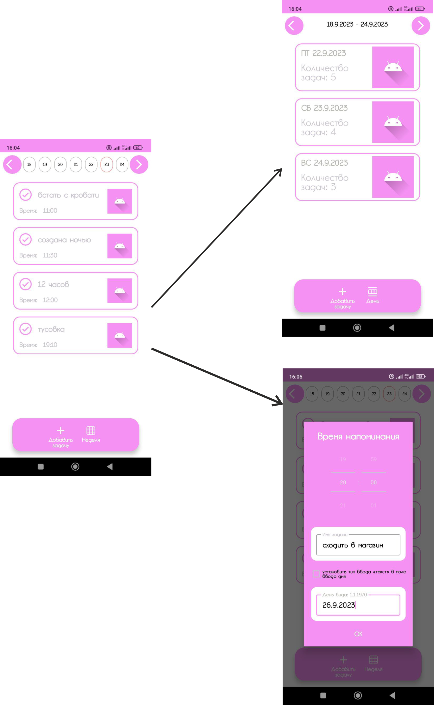

# Your day
## 👋

Hello! This application is designed to plan tasks for the day. Specify the date and time of the task and the application will not let you forget to complete it!
____
## App navigation

The application has 1 screen, but it has 2 viewing modes:
1. View by day
2. View the entire week

There is also a dialog box for creating a task.

____
## Instructions for use
When you start the application, the start screen opens with today's week, with the view of days displayed. Next, you click on the “Add task” button and add a task for the selected day. If a task was added for the current day, it will appear on the today's screen. At the appointed time, the application will send a notification that this task needs to be completed. If you want to see how many tasks you have planned for the week, simply change the display type to “Week”.

## A little about the features of the application.
1. The picture with “Android” was made for the potential addition of stickers to the task. As planned, the sticker should briefly convey the essence of the task. In week view mode, on each day there will be a sticker with the predominant type of task for that day. At the moment I don’t have a list of stickers, so this feature will appear later.

2. In the task creation dialog, there is a checkbox with a choice of a different keyboard for entering the day. This is done so that users who do not have a keyboard on their phone to enter the date have the opportunity to enter text like 1.1.1970. This was revealed from application tests, but if you have such a keyboard on your device by default, you can forget about this checkbox.
_____
## List of technologies
1. Development language: kotlin
2. Design pattern: MVVM + Single Activity
3. DI: Dagger2
4. Asynchrony: Coroutine
5. Data base: Room

